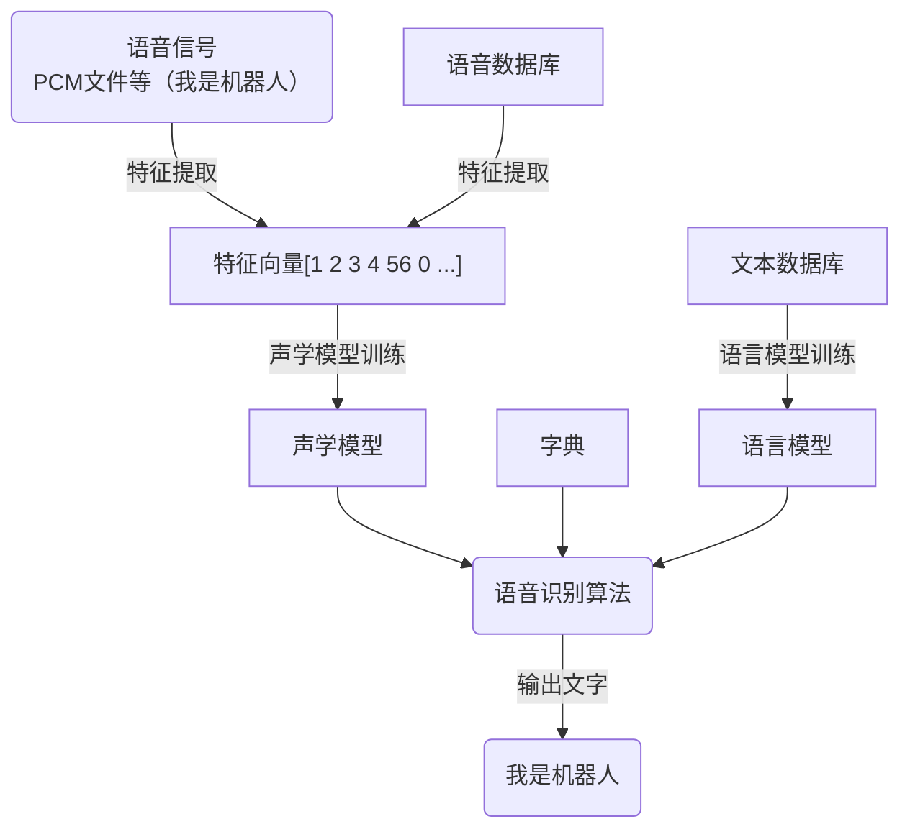

## 一、项目简介

### 引言

> 这是一个关于语音识别（Speech Recognition）检测敏感词的项目。

!!!note inline end
    研究语音识别检测敏感词可以更好的整顿网络视频环境，提高全民素养，为视频平台提供良好的不文明行为打击方法，为网络游戏平台创造更健康更文明的游戏生态。

该项目粗分为两个系统：

1. 语音处理系统
2. 反馈处理系统

一般而言：反馈处理系统即检测敏感词以后所进行的反馈调节，是由用户（产品使用者）个性化设置的，但为了方便用户使用，我们会提供几个可供调用的方法（例如API服务或者在线检测网站）；语音处理系统是本项目的核心组成，由语音信号采集、语音信号预处理、语音信号特征参数提取、向量量化（VQ）和语音识别（SR）组成。

## 二、项目背景、目的及意义

### 项目背景

语音识别是一门交叉学科。近二十年来，语音识别技术取得显著进步，开始从实验室走向市场人们预计，未来10年内，语音识别技术将进入工业、家电、通信、汽车电子、医疗、家庭服务消费电子产品等各个领域。语音识别听写机在一些领域的应用被美国新闻界评为1997年计算机展十件大事之一。

而随着21世纪科技的不断更新迭代，也新兴了许多短视频平台、即时通讯平台、线上游戏平台，越来越多人成为网民并体会着这些平台所带来的乐趣。**然而**，网络暴力的发生频率也越来越高，许多人借助互联网这一载体，对受害者进行谩骂、抨击、侮辱、诽谤等。**因此**，如何建造一个更健康更文明的网络环境正成为网络平台以及地方政府急需解决的问题。

### 研究现状

语音识别是对语音内容进行提取的一把金钥匙，它的研究可以追溯到半个世纪以前。在本世初，基于语音识别的一些产品已经开始问世。

我国语音识别研究工作起步于五十年代，但近年来发展很快。研究水平也从实验室逐步走向用。

从1987年开始执行国家863计划后，国家863智能计算机专家组为语音识别技术研究专门项，每两年滚动一次。我国语音识别技术的研究水平已经基本上与国外同步，在汉语语音识别术上还有自己的特点与优势，并达到国际先进水平。

然而语音识别发展现状面临窘境，就比如做声环境下的鲁棒语音识别一直是语音识别大规模应的主要绊脚石;过去的大部分语音识别系统的设计主要是针对一些单一环境、单一场景下进行设的，如何做多类别复杂场景下的通用的语音识别也是非常困难的；目前大部分语音识别的研究应用，主要是基于一些大语种，比如说英语、汉语、阿拉伯语和法语等等，我们知道世界上一有6900多种语言，如何快速的实现一套基于任何语言的语言识别系统是非常困难的，它也具有大的战略意义。

该项目的敏感词识别也受此三类问题影响，因此如何更好的解决这三类问题也成为语音识别系统任务里的重中之重。

### 意义及实施必要性

科学技术是推动社会发展的重要力量，但它在给人类带来福祉的同时，也给社会带来大量潜在的风险。其中之一便是推动互联网发展所带来的网络暴力现象；然而在风险社会中，科学既是定义风险的媒介，也是解决风险的资源，因此借助语音识别敏感词可以规整更多非文字的网络暴力现象，更好的建造和谐文明健康的网络环境。

## 三、项目研究方案

### 主要内容：

语音识别（Speech Recognition）是本项目的核心组成部分，其过程包括从一段连续声波中样，将每个采样值量化，得到声波的压缩数字化表示。采样值位于重叠的帧中，对于每一帧，取出一个描述频谱内容的特征向量。然后，根据语音信号的特征识别语音所代表的单词，语音别过程主要分为五步：语音信号采集、语音信号预处理、语音信号特征参数提取、向量量化（学模型、字典、语言模型结合）、语音识别。

采集与预处理：对于一段音频，为降低对后续步骤造成的干扰，首先进行静音切除处理（VAD）其次紧接着是声音分帧；特征提取与向量量化：这里选择滤波器组（MFSC）算法将每一帧波形成一个包含声音信息的多维向量；语音识别：这是解码的过程，通过声学模型，字典，语言模对提取特征后的音频数据进行文字输出。

其中，声学模型（AM）通过对语音数据训练提高精度，输入特征向量，输出音素信息，字典则记录了字或词与音素的对应，语言模型（LM）则通过对大量文本信息训练得到单个字或词相互关联的概率。

### 计划目标：

该项目的用户是网络平台（短视频、线上多人游戏等），防网络暴力于未然，最终目标是搭建一个可以支持用户自定义反馈系统的Api以及程序，达到检测网络敏感词并给出解决方案的地步。

### 思路方法：

根据语音识别的五大步骤，下面给出一个语音识别流程的举例（只是形象表述，不是真实数据过程）：

### 项目组织及进度安排：

本项目预期一年内完成，年度研究计划如下：

1. 2022.11-2023.02：
   
通过调用Python现成的API以及编写敏感词库实现最基本的检测敏感词功能，以此作为项目工的示例，为日后声音模型和语言模型打下基础。

2. 2023.03-2023.07
   
构建语音数据库，对大量的语音进行特征处理，并进行声音模型训练，构建声学模型。

3. 2023.05-2023.09

构建文本数据库，进行语言模型训练。

4. 2023.07-2023.09

字典提取和编写。

5. 2023.09-2023.11

编写语音解码识别和搜索算法，语音输入进行测试，编写Api与调用网站。

[1]Speech Processing for Machine Learning: Filter banks, Mel-FrequencyCepstral Coefficients (MFCCs) and What’s In-Between | Haytham Fayek

[2]姜方炳.“网络暴力”:概念、根源及其应对——基于风险社会的分析视角[J].浙江学刊,201(06):181-187.

## 四、项目研究条件及创新之处

### 项目所具备的基础

语音识别意味着当人类说话时，机器会理解它。我们前期使用Python中的Google Speech API实现它。Pyaudio库有着强大的音频处理函数，而SpeechRecognition库也越来越成熟PocketSphinx 是一个用于语音转换文本的开源 API，它是一个轻量级的语音识别引擎， 尽在桌面端也能很好地工作，它还专门为手机和移动设备做过调优。speech_recognition 默认别英文，是不支持中文的，需要在Sphinx语音识别工具包里面下载对应的普通话包和语言模型至此，所有关于调用第三方API方法的检测用户输入语音（音频文件、麦克风）的准备工作已经成了，前期调用测试的工作会相对简单些。

在语音识别（SpeechRecognition）和话者识别（SpeakerRecognition）方面，虽然最常用的语音特征就是梅尔倒谱系数（MFCC），但为了保留更多原始数据，因此使用滤波器组（MFSC算法对语音进行预处理和特征参数提取，这也是研究的重心。

除此之外，本项目后期在对大量语音文件和文本文件处理后，得到的更偏向短视频或线上游戏台言语辱骂场景的敏感词语言模型以及声学模型可以更加确保本项目的顺利开展和结题。

### 项目优势

计算滤波器组（MFSC）所需的所有步骤都是由语音信号的性质和人类对此类信号的感知所驱
的。相反，计算MFCC 所需的额外步骤是由某些机器学习算法的限制引起的。MFSC就是相当
MFCC去掉最后一步的离散余弦变换，跟MFCC特征相比，Fbank特征保留了更多的原始语音数据。

因为深度神经网络不太容易受到高度相关的输入的影响，因此离散余弦变换（DCT）不再是必要
步骤。值得注意的是，离散余弦变换（DCT）是一种线性变换，因此是不可取的，因为它丢弃了
音信号中的一些高度非线性的信息。质疑傅里叶变换是否是必要的操作是明智的,鉴于傅里叶变
本身也是一种线性运算,因此忽略它并尝试直接从时域中的信号中学习可能是有益的。 事实上
最近的一些工作已经尝试了这一点，并报告了积极的结果。然而，傅里叶变换运算是一个难以
习的操作，并且可能会增加实现相同性能所需的数据量和模型复杂性。 此外，在进行短时傅里
变换（STFT）时，我们假设信号在短时间内是静止的，因此傅里叶变换的线性度不会构成关键
题。

这也是MFSC越来越受欢迎的原因。

### 项目风险

在项目背景中也明确提及当今语音识别面临以下三个困境：

> 1.噪声鲁棒性

做声环境下的鲁棒语音识别一直是语音识别大规模应用的主要绊脚石，我们如何在一些噪声场景比较大的情况下，比如说我们的马路、咖啡厅，公共汽车，飞机场，以及会议室，大巴上等等，使得得到很高的识别精度，这是非常具有挑战性的。

> 2.多类复杂性

过去的大部分语音识别系统的设计主要是针对一些单一环境、单一场景下进行设计的，如何做多类别复杂场景下的通用的语音识别是非常困难的，比如说在Youtube或者BBC上的一些数据，可以来自各种各样的语境和场景，有新闻广播、新闻采访、音乐会、访谈、电影等等，如何在多预警下做成一个通用的鲁棒的语音识别性能呢，是比较有挑战性的。

> 3.低数据资源与多语言

目前大部分语音识别的研究和应用，主要是基于一些大语种，比如说英语、汉语、阿拉伯语和法语等等，我们知道世界上一共有6900多种语言，如何快速的实现一套基于任何语言的语言识别系统是非常困难的，它也具有重大的战略意义。

### 项目创新点

   要知道，本项目特别针对的是国内网络暴力敏感词频出的现状，因此采用MFSC算法更好的保留原始数据，训练出一套针对国内网络暴力的敏感词检测声学模型以及语言模型，除了针对性以外，MFSC也不再收到机器学习算法的限制。

## 五、项目预期成果

### 知识产权成果

   Fbank是需要语音特征参数提取方法之一，因其独特的基于倒谱的提取方式，更加的符合人类的听觉原理，因而也是最为普遍、最有效的语音特征提取算法。基于滤波器组的特征 Fbank(Filter bank)， Fbank 特征提取方法就是相当 于 MFCC 去掉最后一步的离散余弦变换（有损变换），跟 MFCC 特征， Fbank 特征保留了更多的原始语音数据。

### 经济效益

   （1）应用于一系列因语音识别发展而新兴的语音APP。
   （2）应用于各大短视频平台、线上交友平台。
   （3）应用于各类线上游戏平台的语音聊天功能。

### 社会效益

    该项目的研究有助于政府与网络平台整顿网络暴力（视频或语音对话中的言语辱骂等不文明行为），建造更加文明健康的网络环境。

## 六、项目财务预算

   （包括经费预算及经费支出明细等）
